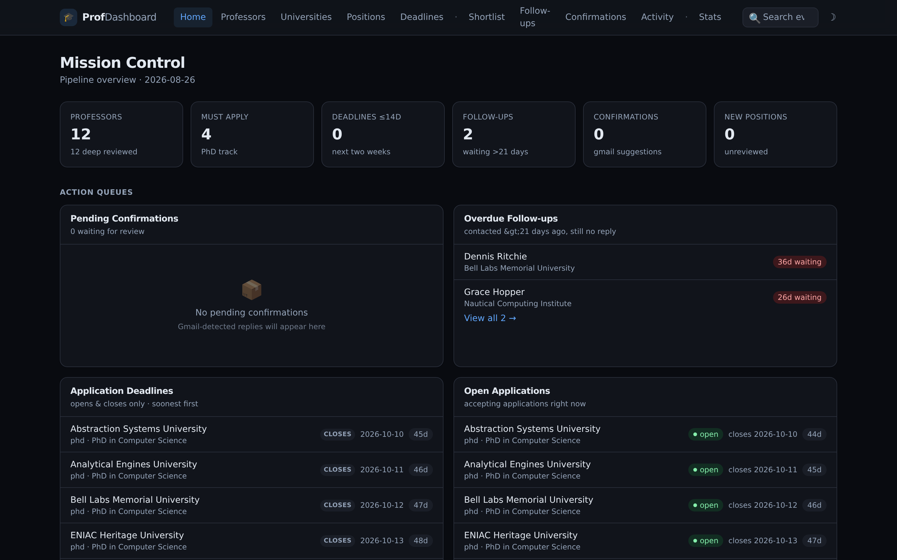
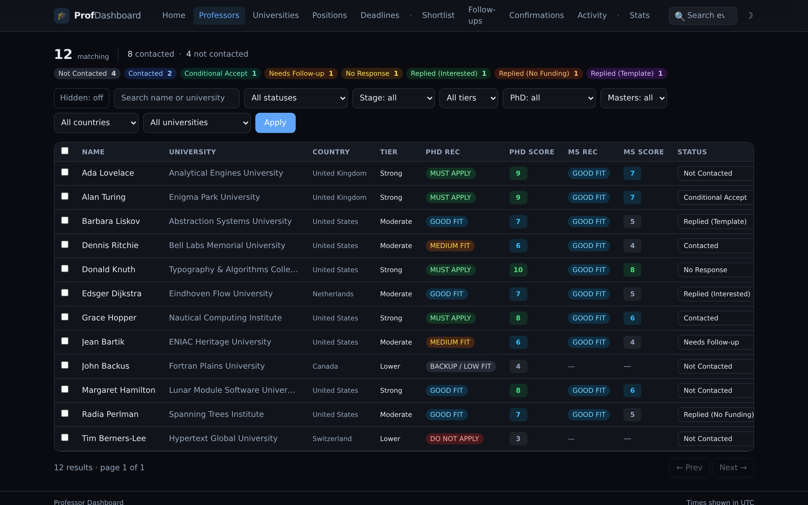
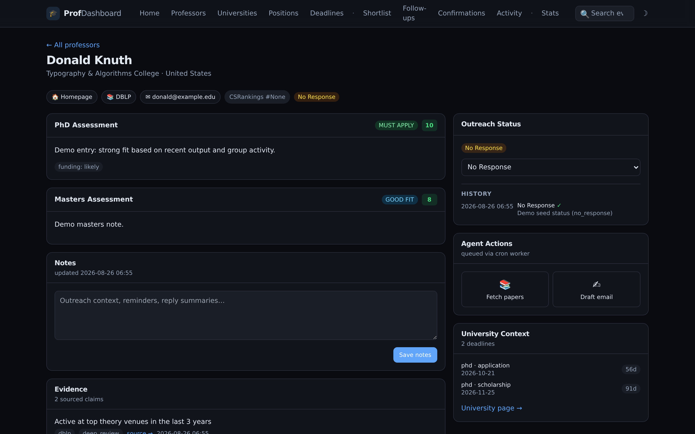

# profdash

**A self-hosted professor outreach tracker for prospective CS grad students.**

Import the CS faculty landscape, score it against *your* research interests with an AI agent you control, track every email you send, and let Gmail reply-classification surface the responses that matter — all in a fast local dashboard. Your data never leaves your machine (except the API calls you choose to make: DBLP, Gmail).



## Why

Applying to CS grad programs means emailing dozens (often hundreds) of professors. Spreadsheets collapse fast. profdash is a pipeline:

1. **Import** ~10k active CS faculty from [CSRankings](https://csrankings.org) (name, university, country, homepage, Scholar, ORCID) — filtered to whatever countries you care about.
2. **Score** the backlog with an AI coding agent (Claude Code, Codex, ...) driven by a prompt pack this repo ships: the agent fetches each professor's DBLP publication digest, judges research fit against your profile, and writes **evidence-backed** judgments into SQLite. Nothing is invented — every claim quotes a real fetched source.
3. **Outreach**: one-click paper-fetching and email-drafting per professor (drafts land in your Gmail Drafts folder — nothing is ever sent automatically).
4. **Track replies**: a Gmail scanner classifies incoming replies (interested / no-funding / template / rejected / ...) with confidence levels and queues them for **your confirmation** — a human always approves status changes.
5. **See the whole pipeline**: deadlines, universities, positions board, follow-ups, shortlists, and stats.

## Screenshots

| | |
|---|---|
|  |  |
| **Filterable, sortable table with bulk actions** | **Scores, evidence, papers, drafts per professor** |

## Quickstart

```bash
pip install profdash            # or: pipx install profdash

mkdir my-outreach && cd my-outreach
prof init --demo                # database + starter profile + sample data
prof serve                      # → http://localhost:8000
```

Explore the demo, then get real data:

```bash
prof import csrankings --country Germany --country Switzerland
# or everything: prof import csrankings        (≈30k rows, cached locally)
```

Then edit `profile.toml` (your name, bio, research interests, timezone, venue tiers) and start scoring — see [docs/scoring.md](docs/scoring.md).

## What's in the box

| Command | What it does |
|---|---|
| `prof init [--demo]` | Create `./data/profdash.sqlite` + `profile.toml` in this directory |
| `prof import csrankings` | Pull faculty from CSRankings (GitHub), map affiliations → countries |
| `prof serve` | Run the dashboard (FastAPI + HTMX, no build step) |
| `prof digest <ids...>` | Fetch DBLP publication digests for scoring |
| `prof apply judgment.json` | Apply one AI/human scoring judgment (validated, evidence-required) |
| `prof worker tasks` | Process the paper-fetch / email-draft queue |
| `prof worker gmail-scan` | Scan Gmail replies → confirmation queue |
| `prof setup-gmail` | One-time OAuth flow for the Gmail features |
| `prof audit` / `prof backup` | Data-quality report / consistent snapshot backups |

## The dashboard

- **Mission control** — stats, pending confirmations, overdue follow-ups, deadlines
- **Professors** — sortable/filterable table, bulk status updates, stage tracking (`triaged` → `deep_reviewed`)
- **Professor detail** — scores with evidence quotes, fetched papers, email drafts, status history
- **Universities / Deadlines / Positions** — program intel grouped the way you decide
- **Follow-ups** — contacted-but-silent past your threshold (default 21 days)
- **Confirmations** — human-in-the-loop queue for Gmail-detected replies
- **Activity** — full feed of background worker runs

Dark mode by default. Server-rendered Jinja2 + HTMX + Alpine.js + Tailwind (vendored, no CDN, no node_modules). Single SQLite file, WAL mode.

## Configuration: `profile.toml`

Everything personal lives here — never in code:

```toml
timezone = "Europe/Berlin"

[identity]
name = "Jane Smith"
bio = "I am a CS masters student at ... with research interests in ..."
interests_short = "verification and formal methods"
signature = "Jane Smith | MSc CS, Some University"

[self_filter]                  # so the Gmail backfill ignores your own mail
domains = ["myuni.edu"]
name_tokens = ["jsmith42"]
skip_subject_patterns = ['homework|exam|tuition']

[venues]                       # paper relevance + scoring digests
preset = "theory"              # built-in; or point at your own .toml
strong = []                    # extra venues beyond the preset

[outreach]
follow_up_days = 21
min_score_shortlist = 7
```

## Scoring with an AI agent

The scoring pass is deliberately tool-agnostic. You (or your coding agent) run:

```bash
prof digest <professor-id>          # → compact publication digest
# ...agent judges fit against your profile...
prof apply judgment.json            # validated write, ≥2 sourced evidence rows required
```

[docs/scoring.md](docs/scoring.md) contains a ready-to-paste prompt pack for Claude Code / Codex / any agent, including the calibration guidance and the safety rules (never invent papers, never score without evidence, unreachable source ⇒ leave unscored).

## Gmail integration (optional)

```bash
pip install profdash[gmail]
prof setup-gmail --client-secret ~/client_secret.json
prof worker gmail-scan --dry-run
```

Uses read-only + compose scopes. The scanner **suggests** reply classifications into a confirmation queue; you approve or reject each one in the dashboard. Full setup: [docs/gmail.md](docs/gmail.md).

## Self-hosting

The server binds to `127.0.0.1` by default. For LAN access, systemd units and cron schedules, see [docs/self-hosting.md](docs/self-hosting.md). **Note: the dashboard has no authentication** — it's designed for localhost/personal LAN use; don't expose it to the internet.

## Data & provenance

- Faculty data: [CSRankings](https://github.com/emeryberger/CSrankings) (MIT license), cached under `~/.cache/profdash/`
- Publications: [DBLP](https://dblp.org) search API (mirrors + case-form retries built in)
- Everything else is your SQLite file — back it up with `prof backup`

## Status

v0.1 — extracted and generalized from a personal pipeline that tracked a real application season. Expect rough edges; [issues](../../issues) welcome.

## License

MIT — see [LICENSE](LICENSE). CSRankings data is MIT-licensed by its maintainers; DBLP data is licensed under [CC0](https://dblp.org/legal.html) / in accordance with dblp.org terms.
